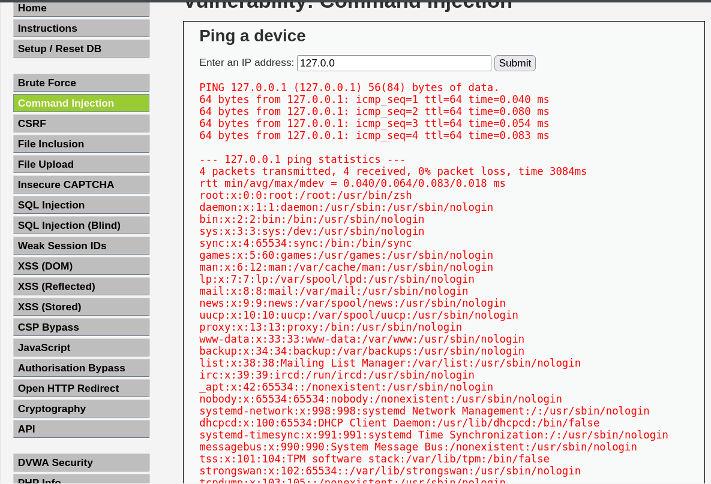
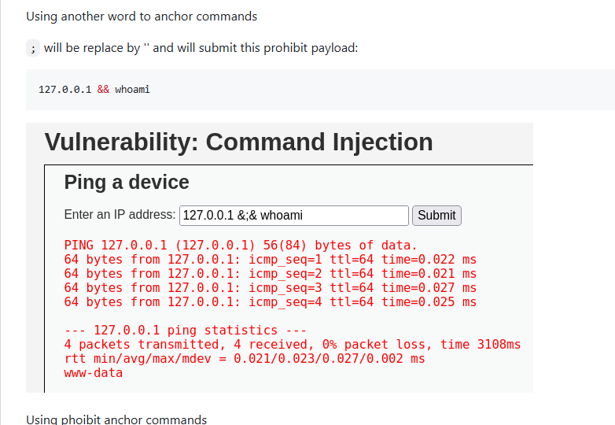
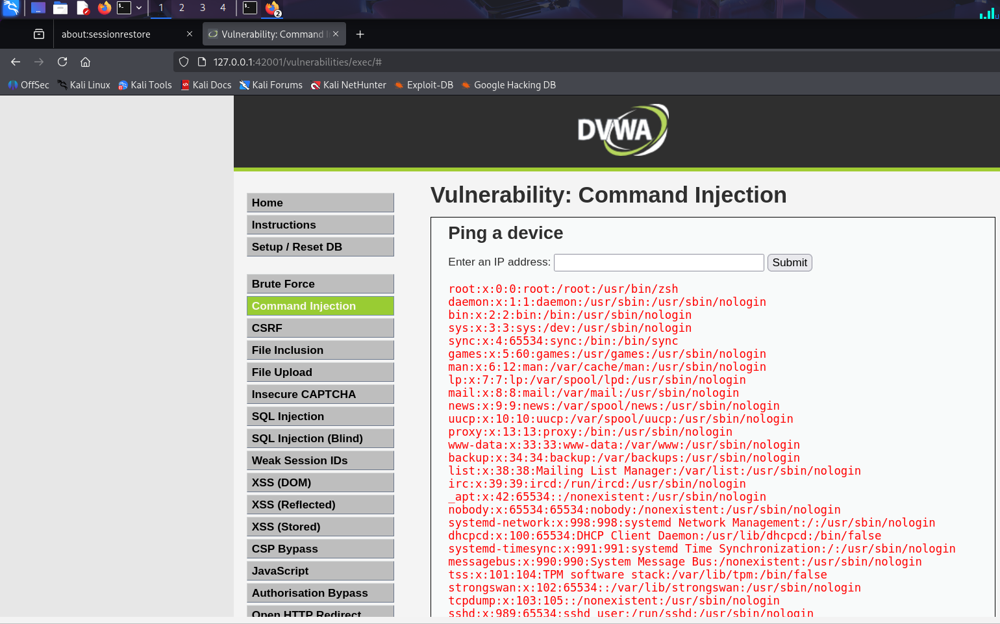

# DVWA: Command Injection Walkthrough

This repository contains my step-by-step exploitation of the Command Injection module in the Damn Vulnerable Web Application (DVWA). 

## Objective
To successfully execute arbitrary operating system commands on the host server across Low, Medium, and High security configurations.

## Exploit Breakdown

### 1. Low Security
* **Vulnerability:** Zero input validation on the `ip` parameter before passing it to `shell_exec()`.
* **Payload:** `127.0.0.1 ; cat /etc/passwd`
* **Result:** The `;` operator allowed sequential execution, successfully dumping the user database.

### 2. Medium Security
* **Vulnerability:** Weak blacklist filtering. The PHP script only stripped `;` and `&&`. 
* **Payload:** `127.0.0.1 | whoami`
* **Result:** Bypassed the blacklist using the pipe operator, executing the command as the web server user.

### 3. High Security
* **Vulnerability:** Filter evasion via developer typo. The blacklist targeted `'| '` (pipe followed by a space).
* **Payload:** `127.0.0.1|cat /etc/passwd`
* **Result:** By omitting the space, the payload evaded the filter and executed successfully. 

## Key Takeaway
Blacklisting characters is an ineffective security measure. Secure applications must rely on strict input validation (whitelisting) and avoid dangerous system calls like `shell_exec()` whenever possible.